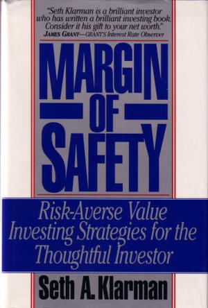

#《安全邊際》 Margin of Safety

作者：塞思.卡拉曼



```
導言

第一部分 多數投資者會在哪裡跌倒

第一章 投機者和失敗的投資者

第二章 與投資者對立的華爾街本質

第三章 機構表現競賽：客戶是輸家

第四章 價值錯覺：20世紀80年代對垃圾債券的迷失和錯誤觀念


第二部分 價值投資哲學

第五章 明確你的投資目標

第六章 價值投資：安全邊際的重要性

第七章 價值投資哲學起源

第八章 企業評估藝術


第三部分 價值投資過程

第九章 投資研究：找到誘人的挑戰

第十章 價值投資者的機會所在：催化劑、市場無效和機構限制

第十一章 投資儲蓄機構轉制

第十二章 投資理財陷入困境和破產的證券

第十三章 投資組合管理和交易

第十四章 個人投資者的投資替代品


附錄一《安全邊際》讀書筆記-枯榮【非原書內容】

附錄二 晚上睡得香比什麼都重要-卡拉曼

附錄三   卡拉曼訪談錄：永遠不要停止閱讀【非原書內容】

編後記   張志雄
```

投資者所採用的投資方法儘管種類繁多，但這些方法幾乎很難帶來長期成功，只會帶來巨大的經濟損失。它們中不具備合乎邏輯的投資程序，更像是投機或賭博。投資者經常經不住想賺快錢的誘惑，結果成了華爾街短暫瘋狂的犧牲品。寫本書的初衷有兩個。其一闡明瞭諸多投資者面臨的陷阱，通過突出許多投資者的錯誤，我希望能夠學會避免損失。其二我推薦投資者遵循一個特定的價值投資哲學。價值投資是以可觀的折扣買入內在價值低估的證券交易策略，以最小的風險獲得較好的長期投資回報。本書闡述了價值投資的哲學，或許更重要的是，解釋了為什麼當別的方法都失敗的時候它卻成功了。


本書開篇，並未談及價值投資是如何做的，主要羅列了許多投資者的錯誤，儘管有很多投資者雖然並未遵循價值投資也達到了他們的投資目標，長期來說，這些操作時很容易誤入歧途的。避免別人犯過的錯誤是達到成功投資重要的一環。事實上，也是完全可以避免的。


你可能有種疑慮，為什麼我要寫這本書，鼓勵更多的人成為價值投資者。我的許多朋友也有此顧慮。這樣一來，我不是招徠了更多的競爭者，間接地降低了我的投資績效嗎？也許是的。但我不認為這種事會發生。首先，價值投資並不是首次公開討論。儘管我在書中列舉的案例與我的前輩不盡相同，儘管我自己的嚴格的投資哲學也與其他的價值投資者的不盡相同，但是其中一些觀點早在 50多年前就被本傑明·格雷厄姆和戴維·多德在他們著名的、被認為是價值投資的聖經——《證券分析》中闡述過了。這本著作為幾代價值投資者指明瞭前進的方向。稍晚一些出版的、由格雷厄姆撰寫的著作《聰明的投資者》更是用淺顯易懂的語言描寫了價值投資的方法。伯克希爾·哈撒韋公司的主席——沃倫·巴菲特，同樣撰寫了大量的文章、致股東的信、致合夥人的信，條理清楚和極為出色地介紹了價值投資。那些對如此至理名言置若罔聞的投資者不見得會特別青睞於我。


真實的意圖還在於我被許多不理性、不自律的投資者所遭受的災難性損失深深地刺痛了。如果我能勸說其中的一些人放棄危險的投資策略，採用那些早已被設計好的能夠保全他們辛苦錢的方法，那麼，我將感到非常的滿足。如果我能對投資人的行為有所觸動，那麼我將很樂意在我自己的績效上適當地減去幾分。


但是無論如何，單憑本書是不可能將任何人轉變為成功的價值投資者。價值投資需要做許多艱苦的工作，非同一般的嚴格紀律和長期的投資視角。只有極少數人願意和能夠為成為價值投資人付出大量時間和精力，而價值投資人中又只有一小部分擁有較強心理素質的人，才能取得成功。


在本書中肯定無法提供一個確保成功的神奇公式。世界上不存在這樣的公式。相反，如果仔細領會書中的內容，則本書僅僅能提高冒有限風險而獲得投資成功的可能性。我認為這應該是理性投資者所理應期望得到的全部。


如果你將本書視為一本傳授如何思考投資，而不是教授投資本身的書，那就再理想不過的了。一些投資者的行為就像是初中生學習代數一樣，只記得一些公式和規則，或者極其膚淺的表面知識，但對他們所做之事並未真正通曉。要想跨越資本市場和實體經濟的循環週期取得長期成功，僅僅捧著一些規則是遠遠不夠的。在投資世界裡太多的事情變化迅速，以至於沒有哪種方法能夠持續成功。因此，成功的關鍵是理解規則背後的基本原理，以便徹底理解為什麼依計行事就能成功，不照章辦理就會碰壁。我可以簡單的告訴你，價值投資能夠成功，但是同時我希望它能成功，而其他方法卻會失敗。


如果星際訪客光臨地球，參觀我們的金融市場的運轉情況，順便考察一下資本市場參與者的行為，他們無疑會質疑這個星球上居民的智力水平。華爾街，這個將資本灑向全世界的資本市場，從許多方面來看都像一個巨大的賭場。對每筆交易進行前端收費的事實明白無誤地表明，相比交易的內在經濟價值，華爾街更關心交易發生的次數。養老基金和慈善基金（或稱捐贈基金）為了長期退休資金、教育和慈善資金的安全和增值，負責任地聘請投資經理，而這些經理卻以瘋狂的短線交易來對待本應該長期投資的證券，每個人作著同樣的事，卻企圖猜透和勝出競爭對手。另外，幾千億的資金採用完全虛擬的、徹底忽略公司基本面的指數化投資策略，以付出註定平庸的代價換取避免大幅落後的尷尬。


個人投資者與機構投資者很相似，他們經常在需要依據公司基本面做出長期投資決定時表現得相當無能。造成這種局面有如下的原因：機構投資者面臨的成績壓力，華爾街的獎勵機制，金融市場的狂熱氣氛。因此，投資者，特別是機構投資者紛紛捲入這場追逐短期相對業績的競賽中，短期價格的波動成為決定勝負的因素。以相對業績為導向的投資者必然關注短期業績，不可避免地會被市場的流行時尚所吸引，並以這種時尚作為取得卓越相對業績的助推器。賺取快錢的衝動是如此強烈，以至於許多投資者發現要做到與眾不同真是太難了。


有時，投資者就是自己最大的敵人。舉例而言，當股價上升時，貪婪驅使投資者參與投機，做出大數額、高風險的賭博，其依據僅僅是樂觀的預期，以及忽略了風險的回報。而在情緒的另一個極端，當股價下跌時，對損失的恐懼讓投資人只注意到股價繼續下跌的可能性，而根本不考慮投資標的的基本面。許多投資人完全不顧市場環境，執著地依靠一個公式來追求成功，但是無情的現實是，數學等式或計算機程序無法帶來成功的投資。


本書的第一部分包括了第一章到第四章的內容，主要說明投資者一般會在哪裡跌倒。第一章的內容探討了投資與投機的區別，成功投資人和非成功投資者的不同之處。闡述了市場價格在投資者行為中的特殊角色。第二章的內容則著眼於華爾街，介紹它的定位短期化、利益衝突、上漲偏見、追求自身利益最大化等等其他投資者完全不需要的行為。第三章的內容解釋了統治當今金融市場的機構投資者的投資行為。


第四章的內容是以垃圾債券的研究案例來說明在前三章中強調的投資陷阱。因新發行的債券源源不斷地加盟而使得整個垃圾債券市場蓬勃興旺，而這一現象很可能是那些放棄了質疑原則的投資者共同串謀的結果。垃圾債券的買家貪婪地接受關於免費午餐的承諾，欣然接受全新的未經證實的分析方法。華爾街和機構投資圈齊聲歡呼這些有瑕疵的投資品的到處氾濫。


投資人必須認識到這種垃圾債券的瘋狂行為並不是千年一遇的癔病發作，而是投資者的情緒在貪婪和恐懼間週期性潮起潮落的結果。投資人不僅要意識到垃圾債券是有瑕疵的（它們本身就是如此），更重要的是從這場完全可以避免的崩潰中汲取教訓，遠離下一場註定要到來的迷人的市場流行色。


仔細檢視其他投資者和投機者的行為的第二個原因就是他們的行為會在不經意間為價值投資者創造出投資機會。舉個例子，機構投資者的行為經常像一隻龐然大物，在完全忽視證券內在價值的情況下，將證券價格打壓到遠離其價值的地步，而在買入時又表現為另一個極端。他們所買的東西來源於偏好，而這些東西的價格常常被極度高估，以至於更像是一次出售（也許是賣空）的機會。而個人投資群體的行為則表現的像一層層的波浪，前赴後繼地將一些證券的價格推升到令人乍舌的地步，其性質和他們不顧一切和隨心所欲地拋售是一樣的。在華爾街和投資銀行家的鼓動下，個人投資者的行為就像機構投資者一樣，不理會，甚至是蓄意忽視企業內在價值的存在，完全將股票作為一張紙牌買進賣出。


這種對投資品基本面的忽略傾向有時會充斥整個股票市場。思考一下在 1987年1-8月股票價格的急速飆升，以及隨之而來的 10月崩盤的案例。用紅杉基金公司的主席和董事長，威廉姆·瑞恩和理查德·坎尼弗的話說，那就是“我們無須理會 1987年1月1日的股票市場的具體價格是否合理，我們能確定的是美國企業的總體價值不會在 8個月裡上升 44%，而更加不可能的是在10月9日，一天之內美國企業的價值下降了23%”。


投資者最終必須為自己選擇立場。一邊當然是錯誤的選擇，似乎是一條容易一些的道路，能夠獲得被認同的滿足感。這趟旅程中包含了對早已征服了大多數市場參與者的某種勢力的屈服，由恐懼和貪婪引導的情緒化反應，由相對業績競賽所催生出來的短期行為。沿著這條路前進的投資者會逐漸形成將股票視為可以買進和賣出的普通商品的理念。而這種方法在最後必須會引導投資者花去大量時間猜測其他投資者將要做的事情，並企圖捷足先登。問題在於，在這場“股票只是你手中可交易的紙牌”的遊戲中，對獲得令人興奮的短期高回報的追逐常常會矇蔽投資者的眼睛，對自己的愚蠢視而不見。


正確的選擇對投資者而言是顯而易見的，但是它要求投資者作出一定的貢獻，而這顯然是大多數人不願意做的。這種選擇就是人所共知的基本面分析方法，這種方法認為股票是它們所代表的企業所有權的憑證。我推薦的投資方法是基本面分析的一個分支——價值投資。


價值投資沒有什麼神祕的。簡而言之就是先確定某個證券內在價值，然後以這個價值的適當折扣買進。事情就是那麼簡單。而最大的挑戰來自於始終保持不可缺少的耐心和紀律，只有當價格變得有吸引力時才買進，而情況相反時就賣出，堅決避免捲入那種吞噬市場人士的追逐短期業績的狂熱之中。


大多數市場人士的關注點與價值投資者的關注點不同。它們首先關心回報——它們能賺多少，而甚少關心風險——它們會損失多少。人們常常用相對業績來評估投資者，尤其是機構投資者，當然，投資者也是如此自評的。這個業績可以是相對於市場的，也可以是相對於市場中的某一板塊的，甚至可能是它們的競爭對手。


相反的，價值投資者第一目標是保證資金安全。很自然地，為了避免未來較大的損失，價值投資者會尋找安全邊際，以便為不準確、壞運氣、邏輯上的錯誤留下緩衝地帶。由於估值是一項非精確的藝術，未來是不可預測的，投資者也是人，難免會犯錯，所以安全邊際是萬萬不可少的。固守安全邊際的理念是區分價值投資者和其他不關心損失的投資者的試金石。


如果投資者能夠預測出市場未來的變動方向，那麼，它們永遠也不可能選擇成為價值投資者。當證券價格穩定上升時，價值方法通常變成了累贅；那些失寵的股票其漲幅要小於那些大眾情人。當市場估值偏向過分高估的時候，價值投資者又會賣出太早而陷入尷尬的境地。


價值投資者的黃金時間是市場下跌的時候。這時候，下跌的風險已經釋放，而其他投資人正在擔憂，那些過度樂觀的產物中哪些能夠倖免。價值投資者則以安全邊際作為護身符，勇敢地進入下跌的市場中大膽投資。


那些能夠預測未來的投資者應該在市場即將啟動時滿倉，甚至是借錢買入，而在市場即將下跌時及時撤出。不幸的是，這些聲稱能夠預測市場走向的投資者常常顯得口氣比力氣大。（迄今為止，擁有預測能力的人我一個也沒見過）。我們自認為無法預測證券價格的走勢，我們接受勸告從事價值投資，這是一種在所有投資環境下都是安全的和成功的投資策略。


在本書的第二部分，第五章到第八章，探討了價值投資的理念和實例。在第五章中檢視為什麼絕大多數價值投資者都是風險的厭惡者，以及與這種態度相對應的投資應用之法。第六章則描述了價值投資的理念，以及安全邊際的含義和重要性。第七章討論了價值投資的三塊基石：自下而上的投資選擇，以絕對收益為導向，將風險和回報一視同仁。第八章介紹了一些價值投資者常用的企業估值方法。


本書第三部分，第九章到第十四章，主要描述了價值投資的過程，以及價值投資理念的應用。第九章探討了當價值投資者得到了投資想法，他們是通過那些研究和分析的步驟來評估這些想法的。第十章則介紹了一些不同的價值投資機會，如公司清算、分拆和風險套利。第十一章和第十二章分別探索了兩個特殊的投資品種：互助儲蓄銀行轉換盒財務危機和破產證券。第十三章則提示了良好的組合管理和交易策略的重要性。最後，第十四章就如何選擇投資專業人士管理你的財產提供了一些建議。


這條價值投資的戒律看上去很簡單，但是很顯然，對多數投資人而言它太難了，以至於無法掌握和堅持。巴菲特曾經說過，價值投資不是一個在一段時間裡讓人逐漸學習和採納的理念，要麼立即領會和馬上付諸實施，要麼永遠無法真正學會。


我很幸運在開始我個人投資生涯時，能師從最成功的投資人中的兩位大師學習價值投資：共同股份公司的邁克爾.普萊斯和馬克思.海涅。雖然我在兒時就被股票市場所吸引，在青少年時也偶爾涉獵其中（成績還可以），但是直到馬克思和邁克爾一起工作，接觸到不可思議的瑰寶，我才明白，同價值投資簡單但是明白無誤的邏輯性相比，我原先的投資顯得多麼天真幼稚。一旦你採用了價值投資的策略，那麼其他的投資行為確實變得如同賭博一樣。


在本書中我就投資公司的所作所為的某些方面提出了批評。許多對業界的批評具有普遍性，針對的是投資公司的整個系統，而不是其中犯錯誤的個人。


書中我提供了許多特殊的投資案例。許多案例是我們公司在過去9年為客戶的利益而策劃的，事實證明也的確有利可圖。然而，我們賺錢的事實其實無關緊要。我的目的是想說明在過去的 10年裡，有許多各種各樣的投資機會出現，而我也捕捉到了。當然，還有許多案例未能列在書裡。


我認為價值投資是一種刺激的、挑戰智力的、動態變化的，同時，也是有財務回報的方法。我希望你投入一些時間去理解書中的內容。


#Reference
http://blog.sina.com.cn/s/articlelist_1894403571_4_2.html
